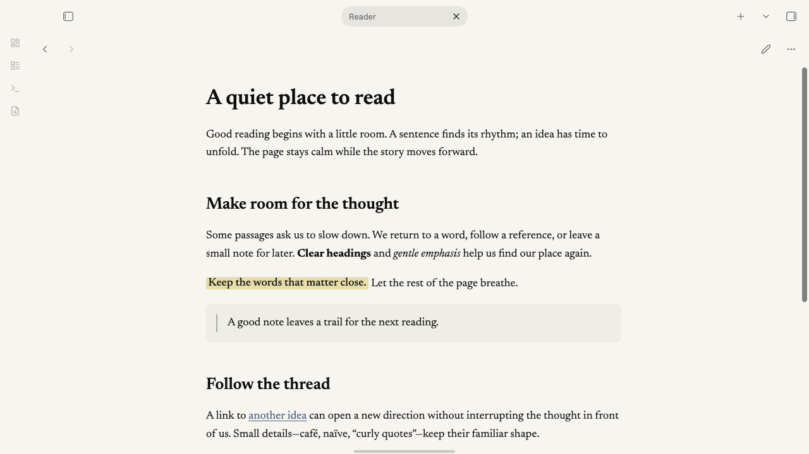
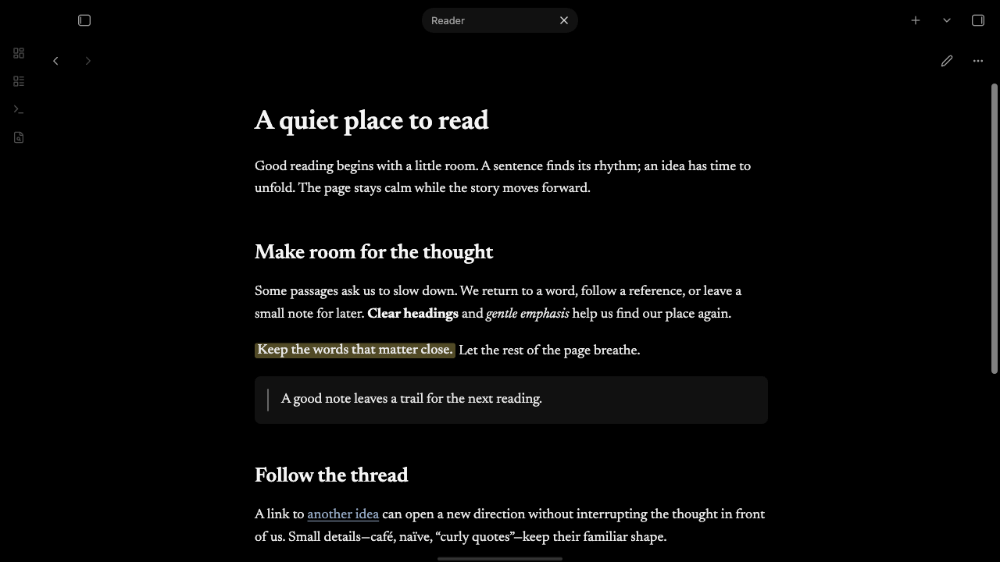

# Cupertino Reading Lab v4

A Cupertino-derived Obsidian theme for long-form reading.

This theme is based on the outstanding Cupertino theme created by Alexis C. Cupertino provides much of the visual foundation and native-feeling interface that made this project possible. This project extends that foundation with a different focus: long-form reading and document consumption in Obsidian.

[Cupertino](https://github.com/svnaxis/obsidian-cupertino) is by [Alexis C.](https://github.com/svnaxis). This derivative is maintained by Logan Juhl. It is not an official Cupertino release. Lineage, license, and approval status: [UPSTREAM.md](UPSTREAM.md).

**[Download 0.4.5](https://github.com/LoganJuhl/cupertino-reading-lab/releases/tag/0.4.5)** — a prerelease for manual installation. [Project status](UPSTREAM.md#status).



## Reading

- Centered `36.5rem` measure. Paragraph spacing `1em`. Leading stays at Cupertino's 1.6.
- Eight bundled static Newsreader faces, with italics. Your Appearance font choice takes precedence. Keep a monospace font for code.
- Six heading levels, authored capitalization, italic H4. Live Preview keeps native editable-line geometry.
- Quiet callouts, normal-ink titles, compact tables, underlined links, warm light paper and a black dark surface.
- Phone: selected text size is a floor; settings rows wrap; tables get a small width extension.
- Wide tables keep native horizontal scroll. Large Mermaid diagrams and Reading View display math scroll inside the note.

Cupertino's `wide`, `max`, table, image, and Bases helpers remain available. Add `table-wide` or `img-max` to a note's `cssclasses` property to widen its tables or images. Use `wide` to widen the whole note.

## Screenshots



Both images are macOS Obsidian captures of a synthetic note. They predate the October width-fallback edit. See [docs/SCREENSHOTS.md](docs/SCREENSHOTS.md).

## Install

1. Download `theme.css` and `manifest.json` from the [0.4.5 prerelease](https://github.com/LoganJuhl/cupertino-reading-lab/releases/tag/0.4.5).
2. Create `.obsidian/themes/Cupertino Reading Lab v4/` in a test vault.
3. Copy both files into that folder. Include `LICENSE` if you share a copy. The CSS already carries the notices.
4. Select **Cupertino Reading Lab v4** under **Settings → Appearance**.
5. Leave **Text font** at Default for Newsreader.

Alternatively, extract the release's `Cupertino-Reading-Lab-v4-0.4.5-owner-test-install.zip` into `.obsidian/themes/`, then follow steps 4–5. The theme needs no plugin, account, or remote font request. Back up an existing theme folder before replacing it; restore that folder or select Cupertino to roll back.

## Compatibility

The manifest minimum is Obsidian **1.13.4**. The full runtime checks used **1.13.7** and Electron **39.8.3** on macOS, in light and dark mode, Reading View, Live Preview, and Source Mode. Those checks cover the preceding CSS; the current build has focused width checks and supplemental macOS checks. The minimum version, Windows, Linux, and physical iPhone behavior remain unverified.

Details: [validation](docs/VALIDATION.md), [maintenance](docs/MAINTENANCE-REVIEW.md).

## Development

`CURRENT.json` selects the source. Root `theme.css`, `manifest.json`, and `LICENSE` are generated.

```sh
npm ci --ignore-scripts
npm run build
npm run check
```

Python 3.11+, Node 22+. The build is offline and uses the checked-in fonts. No runtime JavaScript. See [docs/DEVELOPMENT.md](docs/DEVELOPMENT.md) and [CHANGELOG.md](CHANGELOG.md).

## Credits and license

- **Alexis C. / svnaxis (formerly aaaaalexis) — Cupertino.** Interface and most retained CSS. MIT.
- **Steph Ango / kepano — Minimal.** Cards, image filters, and helpers inherited through Cupertino. MIT.
- **Lucide**, with the upstream Feather notice. Identified `rows-2` icon. ISC.
- **Production Type / Newsreader Project Authors.** Font software, SIL OFL 1.1. The static derivatives are not an endorsement.
- **Craft Docs.** Inspiration credit carried from Cupertino.

Theme code is MIT. Other components keep their own licenses. Complete texts are in [LICENSE](LICENSE). Sources and open questions are in [THIRD_PARTY_NOTICES.md](THIRD_PARTY_NOTICES.md).
